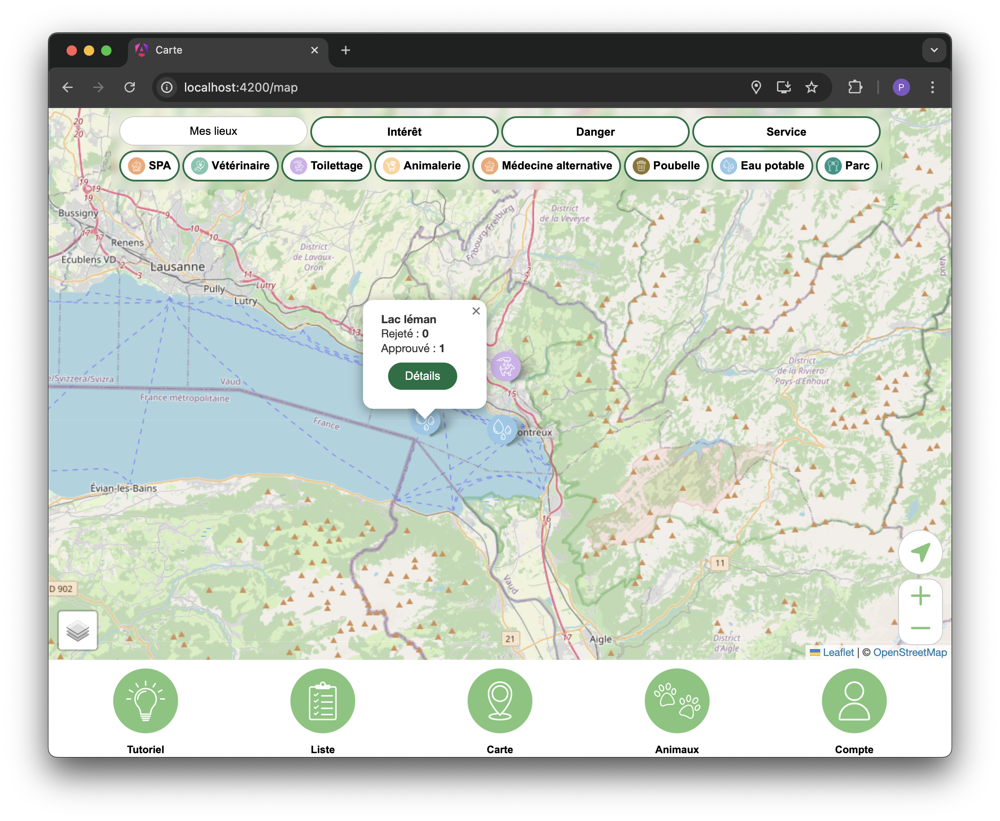
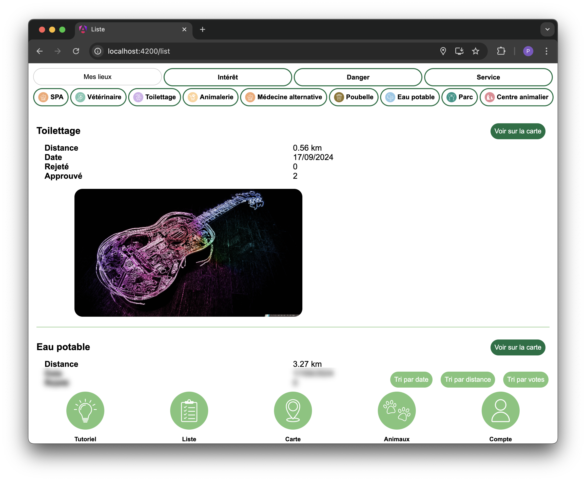
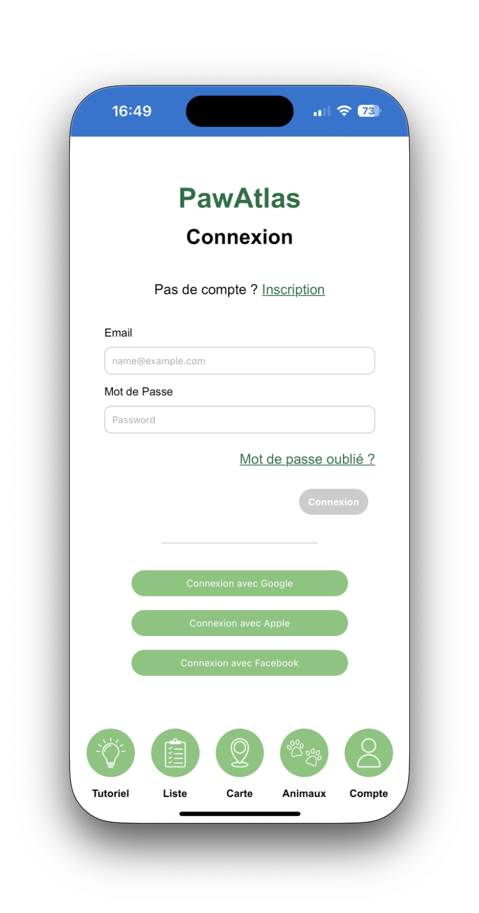
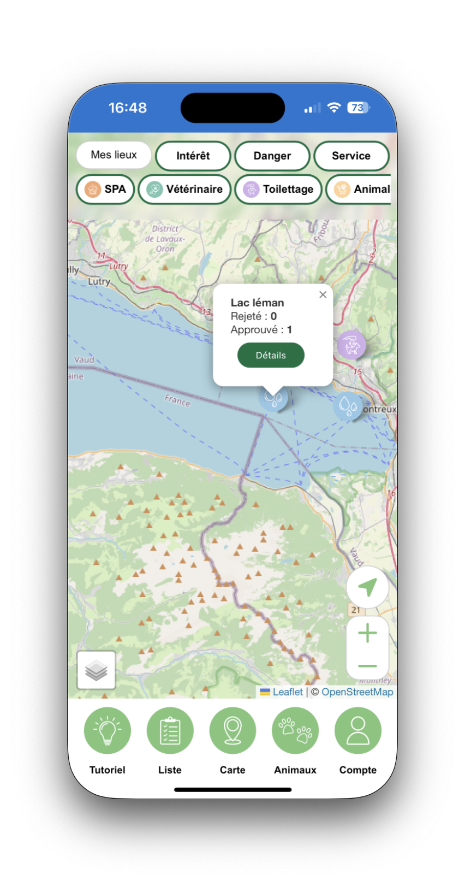
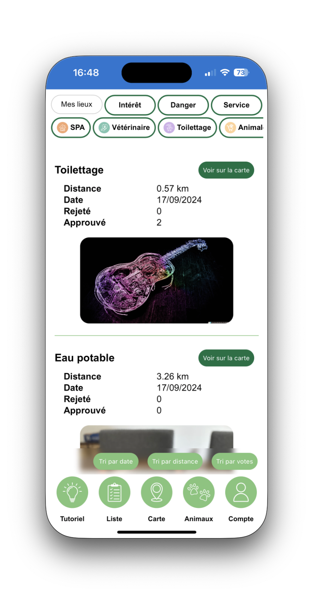
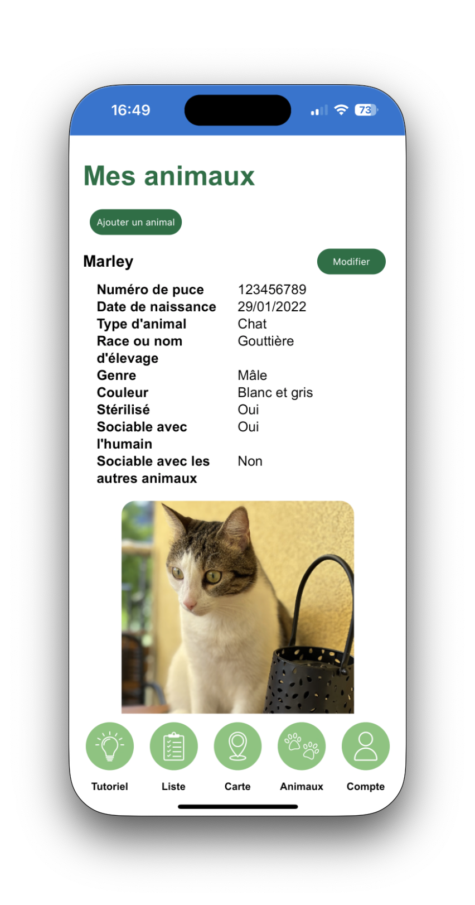

# PawAtlas – Bachelor's Thesis Project

This repository contains two versions of the same web application project:

## pawatlas-serverless

This project was made for my Bachelor Thesis.  
It outlines the steps to build a progressive web app prototype using Angular and Firebase.  
Users can create personal profiles and profiles for their companions,  
then interact with a map to add/view points of interest (e.g., vets, shelters) and hazards (e.g., toxic zones, restricted areas).  
Implemented features include interactive map use cases, authentication, and a NoSQL database.  
The project also analyzes Angular’s benefits, especially for transforming a web app into a PWA.  
Reactive programming concepts were used to handle asynchronous operations efficiently.

You can find several screenshots from when it was live in my Bachelor thesis and also below.

Here is the link of the application:  
<https://pawatlas.pwa.pixelpolo.com/>

Here is the university page listing all student projects:  
<https://www.unifr.ch/inf/softeng/en/research/students.html>

Or you can download the document directly [here](https://www.unifr.ch/inf/softeng/en/assets/public/files/research/students_projects/bachelor/Bachelor_Ricci_Paul.pdf).

## pawatlas-client-server

Refactored version using a NestJS backend and a new Angular frontend adapted to a REST API.  
Same functionalities as above, with a PostgreSQL database and the possibility to add a companion.

Here is the link of the application:  
<https://pawatlas.pixelpolo.com/>

## Some screenshots of the client-server app

  

  

